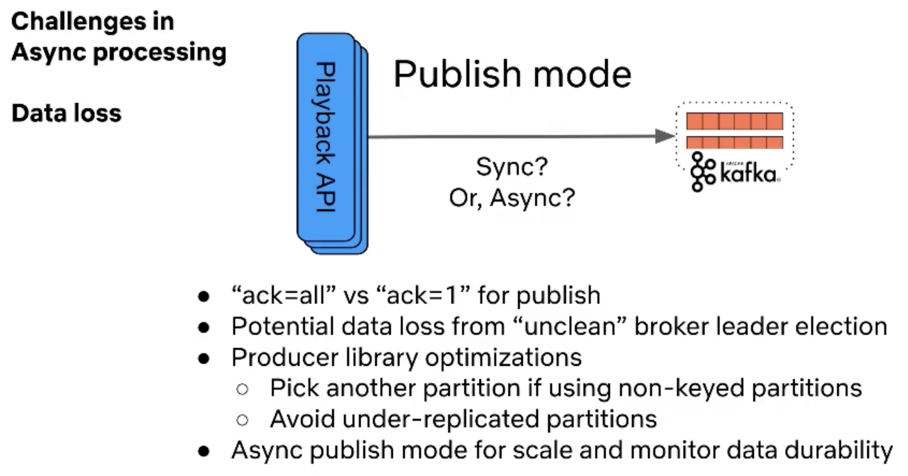
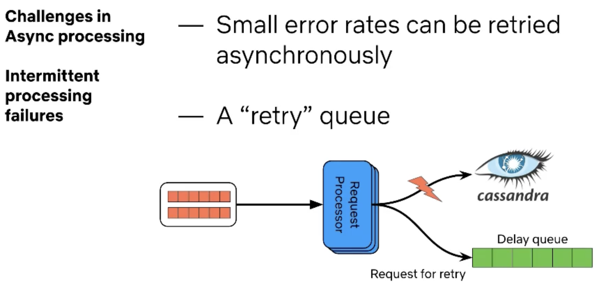
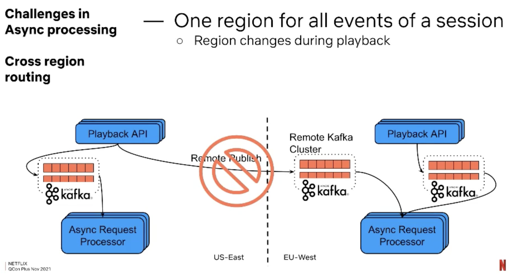
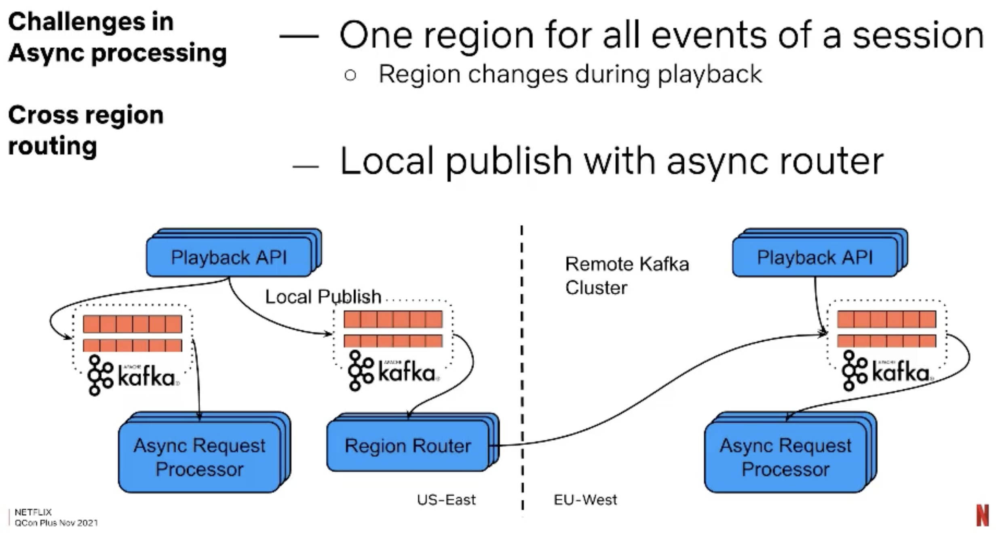

### 21 Nov 2022
* [Evolutionary Database Design](https://www.martinfowler.com/articles/evodb.html) ✅
  * A good read, which lays out a number of best practices when dealing with databases and managing their evolution. 
  * What was interesting to me was the fact that I already know and follow pretty much all of them. It seems like the world of software development (or at least the parts of it I've been in) has moved on quite a bit and what is described in this article is the norm, not an exception. I'm used to working with tools like Liquibase and Flyway to perform database migrations; the architectures I'm working and designing generally dedicate a database per service; migration scripts are kept together with the rest of the application code, or at the very least - are in their own source code repository.
  * There wasn't really anything there to learn, but it is a good resource to reference when discussing these topics with other people.
  * #databases

### 24 Oct 2022 - 
* Property-based testing
  * A colleague presented this approach to testing at work, and I thought it is quite interesting. Not necessarily something that applies to all scenarios, but when it does, it can be quite helpful.
  * From what I understand, non-Java languages and ecosystems are better evolved in this area, but there are Java libraries for this. The one shared with me was [jqwik](https://jqwik.net/). 
    * _Property-Based Testing tries to combine the intuitiveness of Microtests with the effectiveness of randomized, generated test data. Originally driven by the common hype about functional programming, PBT has meanwhile been recognized as an important ingredient of any up-to-date testing approach._

#### 17 Oct 2022 - 
* [Gist for Redis multiset with expiry](https://gist.github.com/veselin-vasilev/4ee80b31c3961fdf8be3756d448528d2)
* [Gist Mockito callback argument matching](https://gist.github.com/veselin-vasilev/00493e3ad1d7b68154ba7c0ad671d497)

#### 03 Oct 2022 - 
* [Pluralsight's getting started with JShell, some useful tidbits in there](https://www.pluralsight.com/guides/getting-started-with-jshell-part-3) ✅
* [JShell Tutorial](http://cr.openjdk.java.net/~rfield/tutorial/JShellTutorial.html#introduction)
  * Quite a comprehensive tutorial, the Pluralsight is based on it, so this could be treated as the "source of truth".

#### 26 Sep 2022 - 
* [Microservices and the Inverse Conway Manoeuvre • James Lewis • GOTO 2015](https://www.youtube.com/watch?v=uicjqeZO690) ✅
  * "_There is nothing so useless as doing efficiently that which should not be done at all_" - Peter Drucker
  * The talk can pretty much be summarised with: _"Design the organisation you want, the architecture will follow (kicking and screaming)" - The Inverse Conway Manoeuvre_ - Evan Botcher.
  * He's essentially saying what's been said by many agile/DevOps practitioners - put the people who need to work together - together. Remove the artificial walls between departments (IT, Finance, Customer, etc.) and unite people around products. It's cross-functionality at a higher abstraction than a software team. A lot of organisations brought QA ands and Devs and BAs etc. and the next logical step is to bring together everyone else who is needed to build a product. 
  * He also talked about the difference in mindset between "project thinking" and "product thinking". Essentialy project thinking is a short-term view of "let's get together to solve a task and move on", and that's not a great way to approach software systems. Further explained by this quote: "_Most application development efforts that we see use a project model: where the aim is to deliver some piece of software which is then considered to be completed. On completion the software is handed over to a maintenance organization and the project team that built it is disbanded._" from [Microservices](https://martinfowler.com/articles/microservices.html) on Martin Fowler's website.
    * The product thinking mindset is captured by this quote: "_The product mentality, ties in with the linkage to business capabilities. Rather than looking at the software as a set of functionality to be completed, there is an on-going relationship where the question is how can software assist its users to enhance the business capability._"
  * #microservices
* [Gist for StructuredArguments and Markers and integration with DD](https://gist.github.com/veselin-vasilev/6ae2320a0c4f8bdbe8ece2284c38961b)
* [Gist for IntelliJ Search and Replace Regex](https://gist.github.com/veselin-vasilev/ab25d06879cecf19c3bd9fc1cae0e8b1)
* [Gist for GitHub Workflow templates](https://gist.github.com/veselin-vasilev/a561d6a51764c9999f8144d8c6cd8f86)
* [Gist for Java time API tidbits](https://gist.github.com/veselin-vasilev/92bb56531ee4ffac1d37eaef5f7d5adc) 

#### 19 Sep 2022
* [Applying the Saga Pattern • Caitie McCaffrey • GOTO 2015](https://www.youtube.com/watch?v=xDuwrtwYHu8) ✅
  * A great overview and demo of the Saga pattern.
  * "_A Saga is a Long Lived Transaction that can be written as a sequence of transactions that can be interleaved. All transactions in the sequence complete successfully or compensating transactions are ran to amend a partial execution_"
  * "_Sagas are a Failure Management Patter_"
  * #distributed-systems

#### 12 Sep 2022 - 
* Spring Boot [Relaxed Binding](https://docs.spring.io/spring-boot/docs/current/reference/html/features.html#features.external-config.typesafe-configuration-properties.relaxed-binding)
  * _Spring Boot uses some relaxed rules for binding Environment properties to @ConfigurationProperties beans, so there does not need to be an exact match between the Environment property name and the bean property name. Common examples where this is useful include dash-separated environment properties (for example, context-path binds to contextPath), and capitalized environment properties (for example, PORT binds to port)._
  * Also should be noted that kebab-case is the recommended syntax in `.properties` and `.yml` files (outlined in Table 3 and the `Tip` section at time of writing). Useful if you ever need a reference for this with regards to Spring Boot.
  * #spring-boot
  * [Relaxed Binding 2.0](https://github.com/spring-projects/spring-boot/wiki/Relaxed-Binding-2.0) highlights some interesting properties of how Spring does relaxed binding. The thing that tripped me up originally was YAML maps - it would remove some characters from the keys, such as forward slash (`/`). To stop it from doing so, I had to wrap the key in `[]`.
    * Related SO questions:
      * https://stackoverflow.com/questions/51289856/spring-application-properties-ignoring-slashes-in-strings
      * https://stackoverflow.com/questions/65346054/ignore-specify-slash-character-in-yaml-config-for-spring-boot-admin-application 

#### 05 Sep 2022 - 
* [The Canada Principle](https://marcrandolph.com/the-canada-principle/)✅
  * First heard about it in [[Marc Randolph]]'s book [[That will never work]] about Netflix's early years.
  * This is a handly link to sum it up nicely. 
  * *We called this The Canada Principle and it served as a constant reminder to us to make sure we didn’t run around chasing what appeared to be low hanging fruit, all the while taking our eyes off what was truly important in scaling our business.*
  * \#guidelines
* [From Monolith to State-of-the-Art Banking • Flavio Deroo • GOTO 2022](https://www.youtube.com/watch?v=gVucnhnyYTw)✅ 
  * [16:00] - quite an interesting point about how they handle their events by aggregating all past events in the last event.
    * Each event chain has an `aggregate_id` and a `sequence` number. 
    * This forces events to be read/processed in sequence, but it gives you immutability guarantees because of the append-only nature of the flow.
      * *Is there a danger that events will become too big?*
    * Overall it was a good session, especially the middle part where he talked about Event-Sourcing and the different projections they have on top of the events.
* [Microservices to async processing migration at scale](https://www.infoq.com/presentations/migration-microservices-scale/)✅
  * If you need to guarantee you get the most robust results, you might require an acknowledgment from all brokers
      * However, this takes time!
  * 
  * Processing latencies
      * You can provision for peak and handle any load which comes your way
          * Good if you have a relatively static load without many large surges.
      * Or, you can autoscale
  * Autoscaling your consumers
      * The tradeoff there is resource efficiency vs taking the hit on partition rebalancing (i.e. the rebalance process takes time and slows down the overall process)
      * If you’re doing stateful operations, you have more work do to during a rebalance
          * When you get the rebalance indication, you need to both commit your Kafka offsets, and also ensure to pass on whatever state you have, so it can be reloaded from another consumer after the rebalance.
      * If you’re doing stateless operations, or you persist state externally, then you will likely be fine letting the rebalance go its way automatically.
          * Worst case is you might get into a situation where you haven’t committed that you’ve handled some messages, which means that another consumer will pick these up (when it gets assigned the same partition) and process them again. If your processing is idempotent, or you don’t care about duplicates, then you have no issue.
      * Lag might be considered a good metric to determine the , and it is good to scale up, but it is difficult to scale down based on it. If your lag is 0, how do you know how much to scale down? You can flip-flop between the number of consumers, that’s a lot of overhead.
      * Proxy metrics - CPU or rps (records per second) work better
          * Rps - based on how many records are processed per second, so based on that you can decide whether to add a new node based on that
      * A few rebalances a day are okay, more means you’re spending a lot of time repartitioning/processing duplicate records.
      * Netflix autoscaler aggressively scales up when the load increases, because they don’t want to be scaling up during a high-load period. They scale down slowly later.
  * 
  * 
  * 
  * What I don’t get for the ^ is why will the remote publish not work when it’s through a tunnel directly to a remote Kafka cluster, but it will work when publishing locally, and then the Region Router passing it to the other region? If US-East is down, so is the Region Router - so what’s the difference?
      * He says “all events of a single playback session can be processed together” - but why is this not possible with the remote tunnel?
  * #kafka #distributed-systems 
* [event-ruler](https://github.com/aws/event-ruler/)
  * [AWS Announcement](https://aws.amazon.com/blogs/opensource/open-sourcing-event-ruler/)
  * Looks really cool, could be a way to handle generic events/requests coming through and generating actions from them.
  * #tools

#### April - August 2022
* [How to filter a stream of events](https://developer.confluent.io/tutorials/filter-a-stream-of-events/kstreams.html#run-your-app-to-confluent-cloud)✅
  * Describes different approaches to filter a stream using Kafka - Streams, ksqlDB.
* [How to Choose Between Strict and Dynamic Schemas](https://www.confluent.io/blog/spring-kafka-protobuf-part-1-event-data-modeling/)🔴
  * Seems like a great article on event modelling.
* [buf CLI](https://github.com/bufbuild/buf)
* [Kafka quickstart with Docker](https://developer.confluent.io/quickstart/kafka-docker/)🔴
* [My Python/Java/Spring/Go/Whatever Client Won’t Connect to My Apache Kafka Cluster in Docker/AWS/My Brother’s Laptop. Please Help!](https://www.confluent.io/blog/kafka-client-cannot-connect-to-broker-on-aws-on-docker-etc/)🔴
  * The title can be a bit misleading - this is as much a troubleshooting article, as it is an insight into how the Kafka client connects.
* [Protobuf Schema Serializer and Deserializer](https://docs.confluent.io/platform/current/schema-registry/serdes-develop/serdes-protobuf.html)
* [JSON to Proto object](https://stackoverflow.com/questions/28545401/java-json-protobuf-back-conversion)
* Loading a file from resources folder -> https://stackoverflow.com/questions/15749192/how-do-i-load-a-file-from-resource-folder
  * The Spring solution was what I needed
* [A Guide to Kafka Streams and Its Uses](https://www.confluent.io/blog/how-kafka-streams-works-guide-to-stream-processing/)
* [Amazon Principle Engineering community tenets](https://www.amazon.jobs/en/landing_pages/pe-community-tenets)🔴
* [Saxo Bank’s Best Practices for a Distributed Domain-Driven Architecture Founded on the Data Mesh](https://www.confluent.io/en-gb/blog/distributed-domain-driven-architecture-data-mesh-best-practices/)🔴
* Kafka streams deliberations for wall clock time windowing -> https://cwiki.apache.org/confluence/display/KAFKA/KIP-424%3A+Allow+suppression+of+intermediate+events+based+on+wall+clock+time 
* Suppression tutorial -> https://www.confluent.io/blog/kafka-streams-take-on-watermarks-and-triggers/
* This has anwer to wall-clock time processing with Kafka Streams -> https://engineering.wingify.com/posts/kafka-streams-stateful-ingestion-with-processor-api/
* [Testing Kafka Streams](https://kafka.apache.org/22/documentation/streams/developer-guide/testing.html)✅
* ✅
  * Answers a lot of the basic questions around Kafka streams - what happens if a consumer dies, how are stream tasks migrated, etc.
* [Kafka Streams Architecture](https://kafka.apache.org/32/documentation/streams/architecture)✅
* [Event Storming - Alberto Brandolini - DDD Europe 2019](https://www.youtube.com/watch?v=mLXQIYEwK24)✅
  * Some knowledge gaps illustrated for me:
    * I need a concrete definition of a "bounded context"
    * I need a concrete definition of an "aggregate'. 
      * The [DDD_Aggregate](https://martinfowler.com/bliki/DDD_Aggregate.html) article by [[Martin Fowler]] is the best I've found so far.
  * Stages: big picture; process modelling; software design modelling?
  * Interesting point about the obvious solution at [28:20] - if it's too obvious, there's probably some issues with it, otherwise it likely would have been done already - nobody enjoys wasting millions of dollars.
  * "If you can't choose which of the two solutions is better, you need to make the problem harder so you have a clear winner": [31:30]
  * Summary: "Merge the people, split the software (around events, not data)."
* Stripe's blog [Designing robust and predictable APIs with idempotency](https://stripe.com/blog/idempotency)✅
* [JDBC Source Connector: What could go wrong?](https://www.confluent.io/en-gb/events/kafka-summit-london-2022/jdbc-source-connector-what-could-go-wrong/)✅
  * Truly great talk, it managed to explain the problems with the JDBC connector in a simple and entertaining way. It also opened my eyes to what the difference is with the Debezium connector (I used to think the JDBC connector was based on CDC as well...)
* [No More Silos: How to Integrate Your Databases with Apache Kafka and CDC](https://www.confluent.io/blog/no-more-silos-how-to-integrate-your-databases-with-apache-kafka-and-cdc/)🔴
* "Preserve case" option in IntelliJ Find + Replace ! -> if your search matches across both upper/lowercase, it will preserve the casing! Awesome!
  * #tips-and-tricks
* IntelliJ visual select -> will only do Find + Replace within the section you've highlighted. Awesome!
  * #tips-and-tricks
* [https://awsu.me/](https://awsu.me/)
  * #tools
* [lazydocker](https://github.com/jesseduffield/lazydocker)
  * #tools
* [Sampling bias](https://sketchplanations.com/sampling-bias)
  * Interesting resource to refer to (and to be aware of the sampling bias concept overall!)
* [asdf](https://asdf-vm.com/guide/introduction.html) to manage CLI tool versions
  * #tools
* [Vim cheatsheet](https://vim.rtorr.com/)
  * #tools
* [immudb whitepaper](https://codenotary.s3.amazonaws.com/Research-Paper-immudb-CodeNotary_v3.0.pdf)🔴
  * An immutable database, seems interesting!

#### 22 April 2022
* [Using Event-Driven Design with Apache Kafka Streaming Applications ft. Bobby Calderwood
](https://developer.confluent.io/podcast/using-event-driven-design-with-apache-kafka-streaming-applications-ft-bobby-calderwood)✅
  * It rehashes a lot of what I've already read in [[Designing Event-driven Systems]] or [[Jay Kreps]]' "The log...". 
  * The analogy of the chessboard [[Bobby Calderwood]] used was really good. Basically, the board, the pieces, and the current state are your data model. The event model is concerned with modelling how to capture each move by the players. 
  * Learned about [oNote](https://www.onote.com/) which might prove useful in the future. It's an event modelling tool. 
  * [Event modelling](https://eventmodeling.org/) itself is a new concept and process which is worth learning more about.
  * There are other useful links on the episode page!
* [List of Markdown emoji in GitHub](https://gist.github.com/rxaviers/7360908)

#### 6 April 2022 - 21 April 2022
* [What is the difference between a DTO and a POCO (or POJO)](https://ardalis.com/dto-or-poco/)✅ by [[Ardalis]]
	* Nothing I didn't already know, but it is nice to have this summarization that I can refer to.
	* It also pointed me in the direction of [Persistance Ignorance](https://deviq.com/principles/persistence-ignorance)✅, which is an idea I have implicitly adhered to, but never had the name for it. 
		* *The principle of Persistence Ignorance (PI) holds that classes modeling the business domain in a software application should not be impacted by how they might be persisted. Thus, their design should reflect as closely as possible the ideal design needed to solve the business problem at hand, and should not be tainted by concerns related to how the objects' state is saved and later retrieved.*
	* This also reminded me of [DevIQ](https://deviq.com) - *a reference site designed to help you learn about high-level software development topics like domain driven design, design patterns, and antipatterns.* 
		* It could be a useful resource, and could spare me the effort of doing something like this myself.
		* Also, I could use it to refer junior devs towards a good resource for some fundamental practices and principles in software development.
	* #engineering

#### 5 April 2022
* [Staff Engineering at Carta](https://medium.com/building-carta/staff-engineering-at-carta-526b154fd317)✅. 
	* It was an interesting insight into how [[Carta]]'s engineers operate at this level of seniority. It rehashed a lot of content from [[Will Larson]]'s  [staffeng.com](https://staffeng.com). 
	* *Alone, the term “staff engineer” only describes your level, not your role. A staff engineer may align with more than one of these archetypes, or change over time. It is important to recognize that **these are modes of operation that describe your work** — they are not a career path.* (emphasis is mine)
	* There was also an interesting link to a presentation: [Role and Influence: The IC trajectory beyond Staff](https://leaddev.com/leaddev-live/role-and-influence-ic-trajectory-beyond-staff). Should find the time to watch it at some point. 
	* I also liked the link to [Engineering Ladders](http://www.engineeringladders.com) and how they've defined the 5 axes for an engineer's development: 
		* Technology
		* System
		* People
		* Process
		* Influence
	* #career #staff

#### 3 April 2022
* Read the [guides](https://staffeng.com/guides)✅ portion of [staffeng.com](https://staffeng.com) by [[Will Larson]]. It is definitely a great resource, one that I will keep coming back to as my career progresses. When the time comes to consider aiming for a Staff of Principal position (if this is still my inclination years in the future), it will definitely be reread.  
* I am still to make my way through the [Stories](https://staffeng.com/stories) section.
* As with a lot of technical books, the [resources](https://staffeng.com/guides/learning-materials) section is where *a lot* of added value can be found. I will regularly come back to it for inspiration on things to read or watch.

#### 2 April 2022
* [Fallacies of distributed computing](https://en.wikipedia.org/wiki/Fallacies_of_distributed_computing)✅
	* Useful to keep as a reference of things to keep in mind!
	* #engineering  #distributed-systems 

#### 1 April 2022
* [Embedded Finance](https://risksave.com/news/2022/3/25/embedded-finance)✅
	* Article shared by [[Currencyclours]]'s [[LinkedIn]] account. 
	* Written by a partner of theirs - [[RiskSave Technologies]]
	* Outlines what embedded finance means for the fintechs of the world and how it's likely becoming a big thing in a lot of offerings, both traditionally financial and not.
	* *If you’ve used a popular ride-sharing app or taxi service or enjoyed a take-away from [Deliveroo](https://deliveroo.co.uk/), then you’ve benefited from embedded finance.*
	* #finance #fintech 
* [Embedded Finance: What It Is And How To Get It Right](https://www.forbes.com/sites/forbesfinancecouncil/2021/08/27/embedded-finance-what-it-is-and-how-to-get-it-right/?sh=6a6cb2173677)✅
	* A [[Forbes]] article on embedded finance.
	* *Simply put, embedded finance is the use of financial tools or services — such as lending or payment processing — by a non-financial provider. For example, an electrical shop could offer point-of-service insurance for goods sold in-store.*
	* #finance #fintech 
* [The Log: What every software engineer should know about real-time data's unifying abstraction](https://engineering.linkedin.com/distributed-systems/log-what-every-software-engineer-should-know-about-real-time-datas-unifying)✅ by [[Jay Kreps]]
	* An incredible piece of technical knowledge, it is a must read!
	* It is basically a summary of the ideas presented in the [Designing Event Driven Systems] book by [[Ben Stopford]]. Though a "summary" is probably not the right word - Kreps' article predates the book. The book merely expands all that is said in the article!
	* **The resources at the end are brilliant as well, probably most of them worth reading or looking into!**
	* #software-architecture #distributed-systems #kafka
* [[Designing Event Driven Systems]]✅ by [[Ben Stopford]]
	* In [O'Reilly](https://learning.oreilly.com/library/view/designing-event-driven-systems/9781492038252/ )
	* Can also be downloaded for free from [Confluent](https://www.confluent.io/designing-event-driven-systems/).
	* A good book, which summarizes a lot of ideas about modern software architecture and distributed systems. Definitely highly recommended!
	* #software-architecture #distributed-systems #kafka

#### 31 Mar 2022
* [Anna Karenina principle](https://en.wikipedia.org/wiki/Anna_Karenina_principle)✅
	* *All happy families are alike; each unhappy family is unhappy in its own way.*
	* *The **Anna Karenina principle** states that a deficiency in any [one of a number of factors](https://en.wikipedia.org/wiki/Limiting_factor "Limiting factor") dooms an endeavor to failure. Consequently, a successful endeavor (subject to this principle) is one for which every possible deficiency has been avoided.
	* I found this out from [[Jay Kreps]]'s article about logs [The Log: What every software engineer should know about real-time data's unifying abstraction](https://engineering.linkedin.com/distributed-systems/log-what-every-software-engineer-should-know-about-real-time-datas-unifying). He phrased it like this: *"Each working data pipeline is designed like a log; each broken data pipeline is broken in its own way."*
* [Atomic Broadcast]([Atomic Broadcast](https://en.wikipedia.org/wiki/Atomic_broadcast)) ✅
	* *In fault-tolerant distributed computing, an **atomic broadcast** or **total order broadcast** is a broadcast where all correct processes in a system of multiple processes receive the same set of messages in the same order; that is, the same sequence of messages. The broadcast is termed "atomic" because it either eventually completes correctly at all participants, or all participants abort without side effects. Atomic broadcasts are an important distributed computing primitive.*
	* #distributed-systems 
* [Efficient data transfer through zero copy](https://developer.ibm.com/articles/j-zerocopy/?mhsrc=ibmsearch_a&mhq=zero)🔴
	* Didn't read the whole thing, and it seem fairly low level, but it is nice to be aware of the concept of "zero copy data transfer". As far as I understand it, it's basically a way to bypass the hop through the application layer that a piece data has to do before being written out to a web socket, by requesting the kernel to kopy the data directly from the disk file to the socket.
	* #engineering 
* [Building LinkedIn’s Real-time Activity Data Pipeline](http://sites.computer.org/debull/A12june/pipeline.pdf)🔴
	* Kafka's paper
	* #kafka #software-architecture #engineering #distributed-systems 
* [IN-STREAM BIG DATA PROCESSING](https://highlyscalable.wordpress.com/2013/08/20/in-stream-big-data-processing/)🔴
	* #software-architecture #engineering #distributed-systems 

#### Unspecified timeframe
* [Philosophy of Software Design](https://www.amazon.com/dp/173210221X)✅ by [[John Ousterhout]]
	* Truly a gem of a book!
	* It made me rethink some of the attitudes I had maintained towards software engineering (most of which had been influenced by [[Uncle Bob]]. I now think that this book is a next-level read after [Clean Code](https://www.amazon.com/Clean-Code-Handbook-Software-Craftsmanship/dp/0132350882/ref=sr_1_1?keywords=clean+code&qid=1650805147&s=books&sr=1-1)✅. Just as Clean Code is arguably needed and helpful to a more junior dev, Philosophy.. is needed to make you rethink what Clean Code preaches, evaluate it with your experience, discard what doesn't makes sense, and reconcile the rest. 
	* [[John Ousterhout]]'s [website](https://web.stanford.edu/~ouster/cgi-bin/home.php).
		* The [publications](https://web.stanford.edu/~ouster/cgi-bin/publications.php) page is a treasure trove of resources. 
	* #engineering

